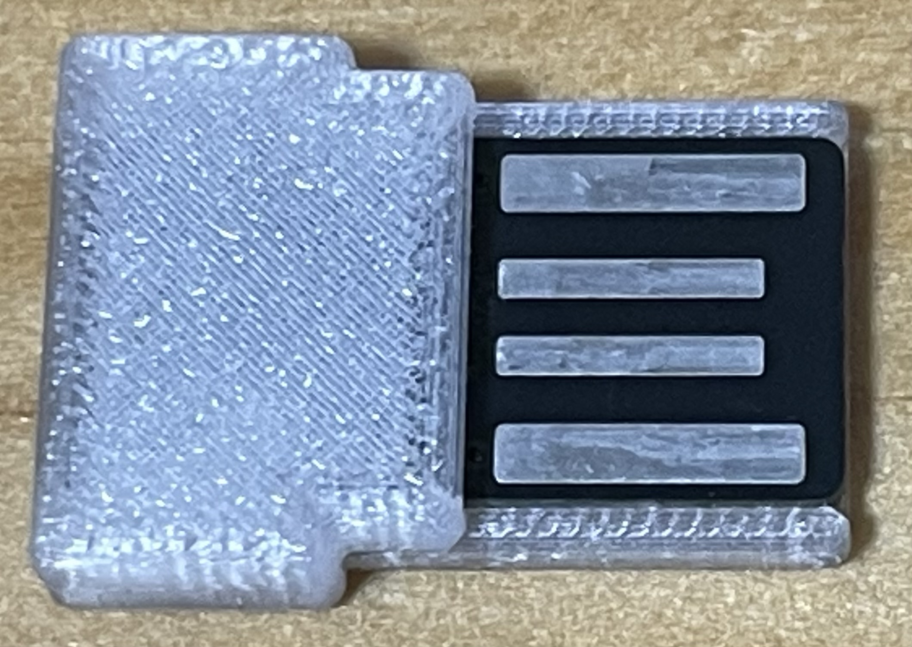
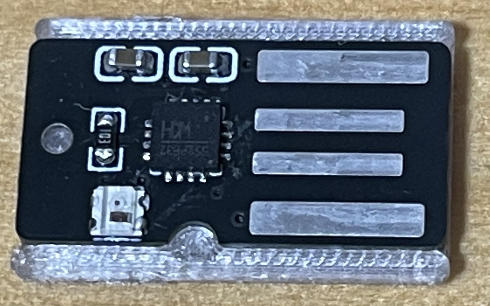

# CH552 USB HID ダミーデバイス

USB-A 直挿し基板に載せた CH552 を、キーボード + マウスの複合 HID として
認識させ、1 分ごとにマウスを 1 ドットだけ往復させてホストのスリープを
防ぐファーム。挿すだけで動き、操作は要らない。WS2812 で状態を表示する。



## 仕様

| | |
|---|---|
| MCU | CH552 (8051 互換 / フラッシュ 16KB のうちユーザ領域 14KB / xRAM 1KB) |
| クロック | 24MHz 固定 (VBUS 5V 直結。データシート上 24MHz は VCC 4.4V 超) |
| LED | WS2812C-2020 x1 @ P1.1 |
| タッチキー | TIN5 @ P1.7 (**既定では無効**) |
| USB | CDC-ACM + HID (キーボード + マウス) の複合デバイス |

### 既定の設定

`config.h` の既定値。挿せばすぐマウスを動かし始め、タッチキーは使わない。

| 設定 | 既定 | |
|---|---|---|
| `MODE_DEFAULT` | `MODE_WIGGLE` | 挿した直後から1分ごとにマウスを動かす |
| `TOUCH_ENABLE` | 0 | タッチキーを使わない |
| `TOUCH_LEARN_ENABLE` | 0 | タッチキーの閾値の学習をしない |
| `MODE_PERSIST` | 0 | モードを Data-Flash に覚えない |
| `CDC_DFU_1200BAUD` | 1 | 1200 baud でブートローダへ入れる |
| `SUSPEND_POLICY` | `SUSPEND_SLEEP` | ホストのサスペンド中は CH552 ごと眠る |

### モード

| モード | 動作 | LED |
|---|---|---|
| A: IDLE | 何もしない (HID として繋がっているだけ) | 緑 |
| B: WIGGLE | 1 分ごとにマウスを右へ 1、さらに 1 分後に左へ 1、を繰り返す | 赤 |

既定では**挿した直後からモード B** で、1 分後から動き始める。
切り替えはコンソールの `t` で行う (タッチキーを有効にすれば短押しでも
切り替えられる)。`MODE_DEFAULT` を `MODE_IDLE` にすると A から始まる。

切り替えた瞬間から 1 分を数え直すので、切り替えた直後にいきなり動くことは
ない。サスペンドなどで送れなかった場合は、溜まった回数をまとめて撃たずに
復帰後 1 回だけ動かして、そこから改めて 1 分を数える。

### LED の見方

| 表示 | 意味 |
|---|---|
| 消灯 | ホストがサスペンド中 (最優先) |
| 橙の呼吸 | まだ列挙されていない (SET_CONFIGURATION 未達) |
| 緑の呼吸 | モード A |
| 赤の呼吸 | モード B |

呼吸は 2.56 秒で一往復、最大輝度は 0x40。
タッチキーを有効にしたときの表示は「タッチキー (任意)」の節を参照。

### DFU (ブートローダ) への入り方

既定のビルドでは 3 系統。

1. **コンソールで `b` を入力。**
2. **1200 baud トリガ** (`CDC_DFU_1200BAUD`) — 開いて閉じるだけでよい。

   ```sh
   stty -f /dev/cu.usbmodemXXXX 1200
   ```

   CDC の SET_CONTROL_LINE_STATE で DTR が落ちたときに、ボーレートが 1200 なら
   0x3800 へ飛ぶ。Arduino Leonardo と同じ流儀。`screen` で入る場合は
   `Ctrl-A` → `K` で閉じること (`Ctrl-A` → `D` の detach ではポートが開いたままで
   DTR が落ちない)。

   **成功しても合図は出ない。** LED が消え、`/dev/cu.usbmodem*` が消えるだけ
   なので、失敗と見分けがつかない。WCH の ISP デバイス (VID 0x4348 /
   PID 0x55E0) が見えていれば入っている。

   ```sh
   ioreg -p IOUSB -l | grep -q 'idVendor" = 17224' && echo "ブートローダ"
   ```

   macOS の `/dev/cu.usbmodem*` は誰でも開けるので、ローカルの任意の
   プロセスがこのデバイスをブートローダに落とせる。0 にしても
   コンソールの `b` は残る (こちらも CDC を開ければ誰でも打てる)。
3. **ハードウェア** — D+ の 10kΩ プルアップパッドを短絡したまま挿す。
   ファームが USB ごと落ちたときの最後の砦なので、基板から省かないこと。

タッチキーを有効にすると、長押し 3 秒 (`TOUCH_LONGPRESS_DFU`) が 4 つめの
入口になる。

入ってしまったときは抜き差しすれば通常のファームに戻る。

## タッチキー (任意)

既定では無効。`TOUCH_ENABLE` を 1 にすると使える。

| 保持時間 | 触れている間の LED | 離したときの動作 |
|---|---|---|
| 〜1.0 秒 | 青 | モード切替 |
| 1.0〜3.0 秒 | シアン | 閾値を学習 (`TOUCH_LEARN_ENABLE` が 1 のときだけ) |
| 3.0 秒〜 | 白の点滅 | 何も起きない。3.6 秒まで持てばブートローダへ |

`TOUCH_LEARN_ENABLE` が 0 のときはシアンの区間ごと短押しに含まれ、
3.0 秒未満ならモード切替になる。学習が成功するとマゼンタ、採用されな
かったときは黄が点滅する。学習の書き込みは電源 ON から 2 回まで。

タッチキーを有効にすると、呼吸は指を近づけると明るくなり、閾値に
達した時点で 0x40 に張り付く。ホストのサスペンド中はタッチも効かない。

閾値は Data-Flash の保存値 > `TOUCH_THRESHOLD_DEFAULT` (0 以外のとき) >
起動時のノイズ実測からの自動決定、の順で決まる。手で決めるには
コンソールで `m` を流しながら指を当てて delta のピークを見て、`+` `-` で
合わせて `s` で焼く。`i` の `src=` で出どころが分かる。

## ハードウェア

基板は **EasyEDA Pro**、ケースは **Fusion 360** で設計した。
設計データは `hardware/` (基板) と `case/` (ケース) に置いてある。

### 基板 (EasyEDA Pro)

基板の外形は **18.80 x 9.55mm**。



右の 4 つが USB-A の接点、中央が CH552P、左下が WS2812C-2020。
まわりを囲っているグレーの部品がケースの枠 (shim)。

| | |
|---|---|
| `hardware/CH552_dongle.epro2` | EasyEDA Pro のプロジェクト |
| `hardware/CH552_dongle_gerber.zip` | Gerber + ドリル |
| `hardware/CH552_dongle_BOM.csv` | 部品表 (LCSC 品番付き) |
| `hardware/CH552_dongle_schematic.pdf` | 回路図 |

### ケース (Fusion 360)

ケースは 2 部品。`case/` に置いてある。組んだ状態は冒頭の写真を参照。

| | |
|---|---|
| `case/CH552_dongle.f3d` | Fusion のファイル。 |
| `case/CH552_dongle.step` | STEP |
| `case/CH552_dongle_shim.3mf` | 印刷用。USB-A 側の枠 18.70 x 12.00 x 1.80mm |
| `case/CH552_dongle_cover.3mf` | 印刷用。本体側のカバー 10.30 x 14.00 x 3.90mm |

### 印刷

| | |
|---|---|
| プリンタ | Bambu Lab A1 |
| ノズル | **0.2mm** |
| 積層ピッチ | 0.1mm |
| 材質 | PETG |

## ビルド

```sh
brew install sdcc
make                # build/fw.bin
make size           # コードサイズと残量
make timing         # 生成コードからサイクル数を数え直す検査 (下記)
```

対応クロックは 24MHz と 16MHz。`config.h` の `FREQ_SYS` が唯一の出所で、
Makefile にも検査ツールにも同じ値は書かない (片方だけ変えると、実機と
検査で周波数が違うのに合格が出る)。12MHz 以下は WS2812 の NOP 数も
`delay_us` の NOP 数も用意していないので `#error` にしてある。

## 書き込み

```sh
uv tool install ch55xtool
make flash
```

`flash` は `timing` に依存させてある。周期はリンク配置で変わりうるもの
なので、検査を通っていない `.bin` は焼けない。

`ch55xtool` は GPL-3 だが独立したプログラムなので、このファームのライセンスには影響しない。

## ライセンスについて

構造の参考にしたもの (コードのコピーはしていない):

- rikka0w0/CH55x_USB_CompositeDevice (MIT) — 複合デバイスの記述子の並べ方と EP0 ディスパッチ
- ch55xduino (LGPL-2.1) — 1200 baud で DFU に飛ぶ「手順」と、WS2812 で T1H を
  長めに振るという考え方 (実装は別物。あちらは `jc` で分岐、こちらは `mov bit,c` で分岐なし)
- WCH「CH55X 汇编指令说明」 — 命令のバイト数と周期数

## USB の作り

CDC-ACM と HID の複合デバイス。インタフェースは 3 本で、CDC の 2 本は
IAD (Interface Association Descriptor) で束ねている。

| インタフェース | クラス | 端点 |
|---|---|---|
| IF0 | CDC Communications (ACM) | EP3 IN (通知、未使用) |
| IF1 | CDC Data | EP2 IN / EP2 OUT (バルク 64) |
| IF2 | HID | EP1 IN (割り込み 16, 10ms) |

キーボードとマウスを 2 つのインタフェースに分けず、**1 つの HID
インタフェースに Report ID で多重**している (ID 1 = キーボード 9 バイト、
ID 2 = マウス 5 バイト)。理由は端点と USB RAM を CDC のために空けて
おくため。ホストからはどちらも普通に見える。

## CDC コンソール

```sh
screen /dev/cu.usbmodem* 115200
```

ポートを開くと自動でヘルプと現在値が出る。1 文字コマンド。

| キー | 動作 |
|---|---|
| `i` | 現在値 (閾値とその出所、ホストから届いた LED 状態、シリアル番号など) |
| `t` | モード A / B の切り替え |
| `j` | 動作確認のマウスジグル |
| `k` | 空のキーボードレポートを 1 回送る (何も打鍵されない) |
| `b` | ブートローダへ |
| `m` | delta の連続表示 on/off (タッチキー有効時) |
| `+` / `-` | 閾値を ±10 (タッチキー有効時) |
| `s` | 現在の閾値を Data-Flash に保存 (タッチキー有効時) |
| `c` | 保存値を消して自動決定に戻す (タッチキー有効時) |
| `z` | ベースラインを取り直す (タッチキー有効時) |

`i` の `src=` は閾値の出どころ。

| 表示 | 意味 |
|---|---|
| `auto` | 起動時のノイズ測定から決めた |
| `config` | `config.h` の `TOUCH_THRESHOLD_DEFAULT` |
| `flash` | Data-Flash に保存された値。**電源を入れ直しても同じ** |
| `unsaved` | 動いている値が Data-Flash の記録と食い違っている |

## 構成

```
README.md             このファイル
config.h              基板ごとに変わる設定 (ピン、クロック、色、輝度)
include/ch552.h       SFR 定義。データシートの SFR 表から自前で起こしたもの
src/sys.c             クロック設定、遅延、ブートローダジャンプ
src/tick.c            Timer2 のオートリロードによる 1ms タイムベース
src/neo.c             WS2812 ビットバン
src/touch.c           タッチキー。ベースライン追従、閾値の自動決定と学習
src/dflash.c          Data-Flash (128 バイト) の読み書き
src/usb.c             USB デバイスコア。制御転送と端点管理
src/usb_desc.c        記述子 (デバイス / 複合コンフィグ / HID レポート / 文字列)
src/hid.c             HID レポートの組み立てと送出
src/cdc.c             CDC のリングバッファ
src/console.c         CDC 経由の 1 文字コマンド
src/mode.c            モード A / B の状態機械
src/breathe_lut.h     呼吸パターンの輝度テーブル (tools/gen_lut.py で生成)
src/main.c            メインループ
tools/gen_lut.py      輝度テーブル生成
tools/ch55x.py        リストファイルから命令周期を数える共通部品
tools/neo_timing.py   WS2812 のビットタイミング検査 (make timing)
tools/delay_check.py  delay_us の較正検査 (make timing)
tools/naked_check.py  __naked 関数のレジスタ退避検査 (make timing)
tools/oseg_check.py   割り込みの呼び出し木が OSEG に触れない検査 (make timing)
tools/touch_sim.py    タッチ状態機械の模擬 (make touchsim)
hardware/             EasyEDA Pro の設計データ (回路図、基板、Gerber、BOM)
case/                 Fusion 360 のケース (.f3d / STEP / 印刷用 3MF x2)
image/                実物の写真
```
